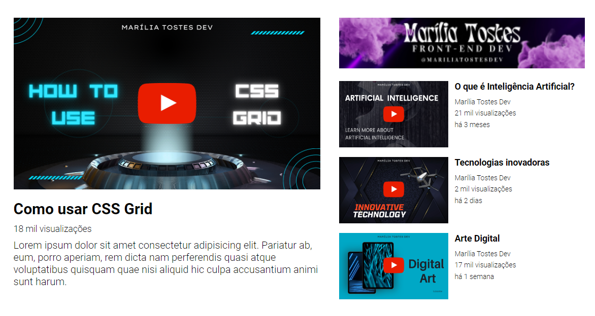

# Layout do Youtube com CSS Grid

Este projeto apresenta um layout semelhante ao do YouTube, utilizando CSS Grid para organizar os elementos. A página inclui um vídeo principal com uma descrição e uma barra lateral com anúncios e recomendações de vídeos.

## Visualização:
### Desktop:

### Responsiva:

## Estrutura HTML

A estrutura HTML é organizada com tags semânticas, como `<section>`, `
`, ``, `<h1>`, `<h2>`, e `
`. O conteúdo é estruturado para facilitar a aplicação de estilos e o posicionamento dos elementos.

## Estilo

### Design Responsivo

O projeto é responsivo, utilizando consultas de mídia para ajustar o layout em telas menores. A barra lateral torna-se uma única coluna em dispositivos com largura máxima de 920px.

### Fontes

A fonte "Roboto" do Google Fonts é utilizada para obter uma aparência moderna e legível.

### Layout

O layout é construído com CSS Grid. O conteúdo é distribuído em uma grade principal (`container`) que contém uma área para o vídeo principal (`video`) e a barra lateral (`sidebar`). As recomendações na barra lateral são exibidas em uma coluna quando a largura da tela é menor que 920px.

### Cores e Espaçamento

As cores e o espaçamento são ajustados para garantir uma aparência agradável e legível. O espaçamento entre os elementos e as margens é cuidadosamente definido para manter uma estética equilibrada.

## Contato

- **Email:** mahtostes.dev@gmail.com
- **LinkedIn:** [LinkedIn - Marília Ribeiro Tostes](https://www.linkedin.com/in/marilia-ribeiro-tostes/)
- **Whatsapp:** [Fale comigo!](https://wa.me/5567981443147)
